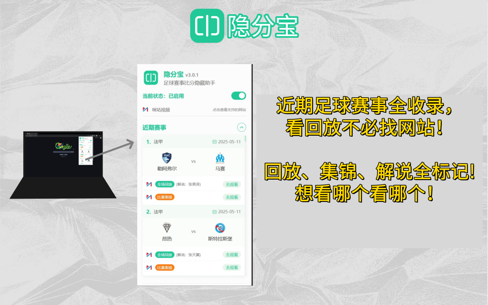
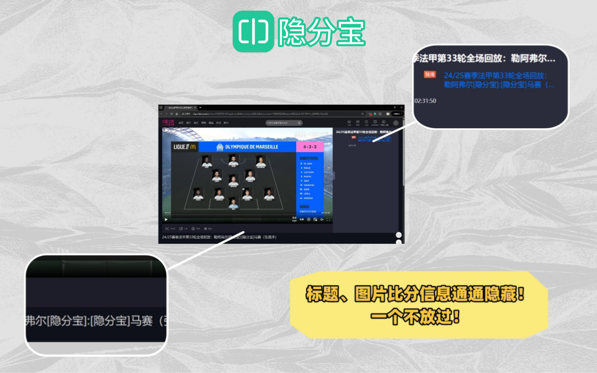
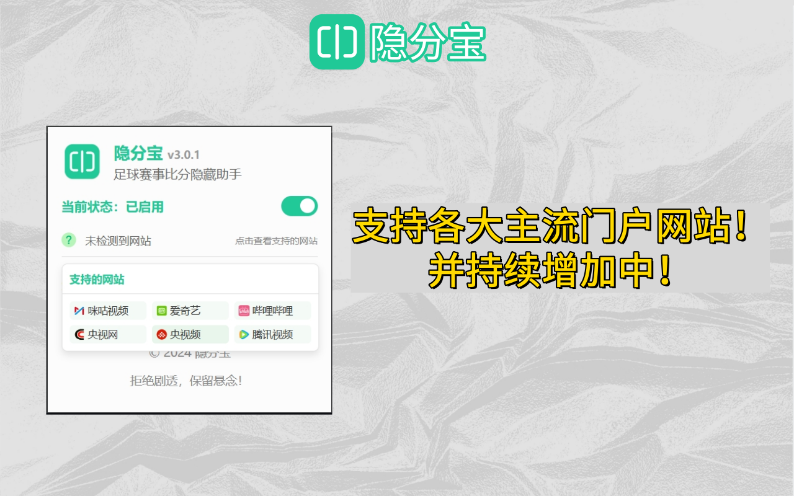

# 隐分宝 - 足球赛事比分隐藏助手

  
   
 <strong>让回放也有直播体验！</strong>
  
  <strong>拒绝剧透，保留悬念！</strong>

## 目录

- [简介](#简介)
- [功能特性](#功能特性)
- [使用方法](#使用方法)
- [已支持的网站](#已支持的网站)
- [安装指南](#安装指南)
  - [PC端安装](#pc端安装)
  - [移动端安装](#移动端安装)
  - [安装后使用说明](#安装后使用说明)
- [常见问题](#常见问题)
- [版本更新](#版本更新)
- [技术支持与反馈](#技术支持与反馈)
- [版权和许可](#版权和许可)

## 简介

隐分宝是一款专为足球爱好者设计的浏览器插件，用于隐藏体育赛事网站上的比分信息，让您能够在观看回放比赛时避免剧透，保持观赛的悬念和乐趣。

无论您是因为工作原因错过了直播，还是想要在闲暇时间回看精彩赛事，隐分宝都能让您在不知道比分的情况下，享受如同直播般的观赛体验。

## 功能特性

- **智能比分隐藏**：自动识别并隐藏网页中的比分信息，包括标题、正文和视频封面中的比分
- **多网站支持**：兼容国内主流体育视频网站，如咪咕视频、爱奇艺、哔哩哔哩、央视网、腾讯视频等
- **一键启用/禁用**：简单的开关控制，随时切换隐藏状态
- **覆盖遮罩层**：页面加载时显示遮罩层，防止用户在页面加载过程中看到比分
- **近期赛事列表**：提供最新赛事信息，直接跳转观看，无需担心剧透
- **解说员选择**：同一场比赛提供多个解说员的视频版本选择
- **专注观赛体验**：让您能够像看直播一样享受比赛的每一个精彩瞬间，不被比分剧透
- **智能内容识别**：精准识别各网站的比分信息，避免误伤其他内容
- **轻量级设计**：对浏览器性能影响微小，不影响网页加载速度
- **隐私保护**：所有处理都在本地进行，不会收集您的浏览数据
- **持续更新**：定期适配新网站和优化现有功能，持续提升用户体验

  

## 效果预览
- pc端

  

- 移动端

  

## 使用方法

1. 安装插件后，插件图标将出现在浏览器工具栏中
2. 点击图标打开控制面板，启用/禁用隐藏功能
3. 访问支持的体育赛事网站，比分信息将被自动隐藏
4. 在控制面板中可以浏览近期赛事，直接点击"去观看"跳转到无剧透的比赛页面
5. 如需切换插件状态，建议刷新页面以确保更改生效

## 已支持的网站

- 咪咕视频
- 爱奇艺 
- 哔哩哔哩 
- 央视网 
- 央视频
- 腾讯视频 

  

## 安装指南

### PC端安装

#### 1. 商店安装（推荐）

##### Chrome浏览器
1. 访问 [Chrome网上应用店 - 隐分宝](https://chromewebstore.google.com/detail/%E9%9A%90%E5%88%86%E5%AE%9D/kagiibpabaiokolfogibbncebfmeolfa?hl=zh-CN)
2. 点击"添加至Chrome"按钮
3. 在弹出窗口中确认安装
4. 安装完成后，浏览器右上角工具栏将显示隐分宝图标

#### 2. 手动安装
##### 使用ZIP压缩包安装
1. 访问 [GitHub发布页](https://github.com/woo-developer/yfb/releases) 下载最新版本的 `.zip` 格式插件压缩包
2. 解压下载的文件到本地文件夹
3. 打开浏览器，在地址栏输入: 
   - Chrome: `chrome://extensions`
   - Edge: `edge://extensions` 
   - 360浏览器: `se://extensions`
   - QQ浏览器: `qqbrowser://extensions`
4. 开启右上角的"开发者模式"
5. 点击"加载已解压的扩展程序"按钮
6. 选择步骤2中解压的文件夹
7. 安装完成后，隐分宝将显示在浏览器扩展列表和工具栏中

##### 使用CRX文件拖拽安装
1. 访问 [GitHub发布页](https://github.com/woo-developer/yfb/releases) 下载最新版本的 `.crx` 格式插件文件
2. 打开浏览器，在地址栏输入:
   - Chrome: `chrome://extensions`
   - Edge: `edge://extensions` 
   - 360浏览器: `se://extensions`
   - QQ浏览器: `qqbrowser://extensions`
3. 开启右上角的"开发者模式"
4. 将下载的 `.crx` 文件直接拖拽到浏览器扩展页面中
5. 在弹出的确认窗口中点击"添加扩展程序"
6. 安装完成后，隐分宝将显示在浏览器扩展列表和工具栏中

### 移动端安装

#### 通过狐猴浏览器安装（推荐）
1. 从应用商店下载安装[狐猴浏览器](https://lemurbrowser.com/)
2. 打开狐猴浏览器，点击右上角三点菜单
3. 选择"扩展"选项
4. 点击"从本地安装"按钮
5. 从[GitHub发布页](https://github.com/woo-developer/yfb/releases)下载的隐分宝zip包，并选择解压后的文件夹
6. 安装完成后，可以在浏览器扩展管理中找到隐分宝
 
#### 通过Kiwi浏览器安装
1. 从Google Play或应用商店下载安装[Kiwi浏览器](https://play.google.com/store/apps/details?id=com.kiwibrowser.browser)
2. 打开Kiwi浏览器，在地址栏输入: `chrome://extensions`
3. 开启"开发者模式"
4. 点击"加载已解压的扩展程序"按钮
5. 从[GitHub发布页](https://github.com/woo-developer/yfb/releases)下载的隐分宝zip包，并选择解压后的文件夹
6. 安装完成后，可以在浏览器菜单中找到隐分宝

#### 通过Yandex浏览器安装
1. 从Google Play安装[Yandex浏览器](https://play.google.com/store/apps/details?id=com.yandex.browser)
2. 打开Yandex浏览器，访问[Chrome网上应用店 - 隐分宝](https://chromewebstore.google.com/detail/%E9%9A%90%E5%88%86%E5%AE%9D/kagiibpabaiokolfogibbncebfmeolfa?hl=zh-CN)
3. 点击"添加至Chrome"按钮
4. 按照提示完成安装
5. 安装后可以在浏览器设置的"扩展程序"中找到隐分宝

### 安装后使用说明

1. 安装完成后，点击浏览器右上角的隐分宝图标
2. 在弹出的窗口中，您可以看到"近期赛事"列表
3. 点击感兴趣比赛旁的"去观看"按钮，将自动跳转至对应视频网站并隐藏比分
4. 如需临时开启/关闭比分隐藏功能，可以点击插件窗口顶部的开关

## 常见问题

**Q: 为什么启用插件后，有些网站的比分依然显示？**  
A: 可能是该网站近期更新了页面结构。请在插件界面提交反馈，我们会尽快适配。

**Q: 插件是否会影响网页的其他功能？**  
A: 插件仅针对比分信息进行处理，不会影响网页的其他功能和操作。

**Q: 如何查看近期赛事？**  
A: 点击浏览器工具栏中的插件图标，即可在弹出的面板中查看近期赛事信息。

**Q: 如何在插件启用的情况下查看比分？**  
A: 可以暂时关闭状态刷新网页后查看比分，之后再重新启用。

## 版本更新

查看隐分宝的最新版本更新内容，了解新增功能、问题修复：

[点击查看完整更新日志 →](./UPDATE.md)

## 技术支持与反馈

如果您在使用过程中遇到任何问题，或有功能建议，请通过以下方式联系我们：

- 电子邮件：woofootball@aliyun.com
- 官方网站：[https://www.woofootball.site](https://www.woofootball.site)
- GitHub：[https://github.com/woo-developer/yfb](https://github.com/woo-developer/yfb)
- GitHub Issues：[提交问题或建议](https://github.com/woo-developer/yfb/issues)

## 版权和许可

© 2025 隐分宝开发团队。保留所有权利。

此插件为原创软件，未经授权不得复制、修改或发布。

---

  <strong>隐分宝 - 让回放也有直播体验！</strong>
   
  <small>拒绝剧透，保留悬念！</small>

 